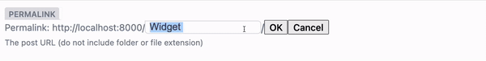

# Decap CMS Permalink Widget

Decap CMS Widget that allows you to create customizable permalinks easily.

Widgets are inputs for the Netlify CMS editor interface. It's a React component that receives user input and outputs a serialized value.

This widget allows you to create custom permalinks that can be used to generate pathnames for Decap CMS based websites. The widget mimics the behaviour of WordPress permalink input field automatically outputting correct slugs.



## Installation

1. Install the widget

```
npm install decap-cms-widget-permalink
yarn add decap-cms-widget-permalink
```

2. Import the Permalink widget to your Netlify CMS setup file

```
import { Widget as PermalinkWidget } from 'decap-cms-widget-permalink';
```

3. Register the widget for use

```
CMS.registerWidget(PermalinkWidget);
```

## Usage details

Inside the YML collecitons file you can use `permalink` as new widget

```
collections:
  - name: "example"
    label: "Example"
    folder: "/path/to/your/folder"
    create: true
    slug: "{{slug}}"
    fields:
      - label: "Permalink",
        name: "permalink",
        widget: "permalink",
        prefix: 'blog', // This allows to add a prefix to the correct url
        url: 'http://example.com'
```

You can also use it as a JS object using Netlify CMS [Manual Initialization](https://www.netlifycms.org/docs/beta-features/#manual-initialization)

Example:

```
{
  label: 'Permalink',
  name: 'permalink',
  widget: 'permalink',
  required: true,
  prefix: 'blog', // This allows to add a prefix to the correct url
  url: 'http://localhost:8000',
  hint: 'The post URL (do not include folder or file extension)',
},
```

This widget is using 2 custom items:
`url` -> is used to visualize and link to the page
`prefix` -> is used when you want to prefix some pages (i.e. `blog` will output -> `/blog/your-slug/`)

### Additional guides

- [ID Widget for Decap CMS](https://github.com/clean-commit/decap-cms-widget-id)
- [Efficient Netlify CMS config with Manual Initialization](https://mrkaluzny.com/blog/dry-decap-cms-config-with-manual-initialization/?utm_source=GitHub&utm_medium=henlo-gatsby)
- [How to optimize SEO with Gatsby & Netlify CMS](https://mrkaluzny.com/blog/how-to-optimize-seo-with-gatsby-netlify?utm_source=GitHub&utm_medium=henlo-gatsby)
- [Full text search with Gatsby & Decap CMS](https://mrkaluzny.com/blog/full-text-search-with-gatsby-and-decap-cms?utm_source=GitHub&utm_medium=henlo-gatsby)
